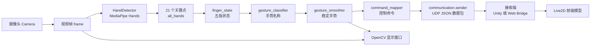
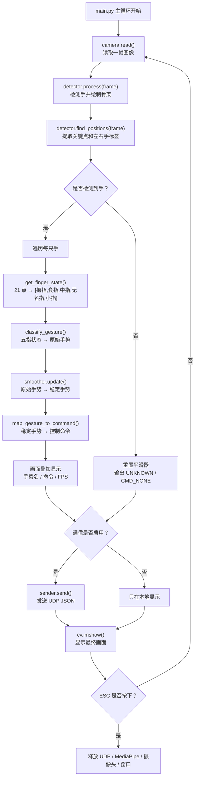
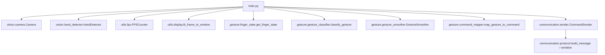
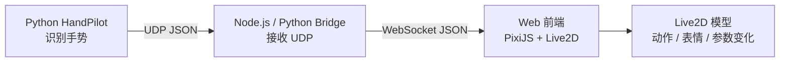

# HandPilot 项目说明文档

## 1. 项目定位

**HandPilot** 是一个基于 **Python + OpenCV + MediaPipe** 的实时手势识别与虚拟角色控制项目。

当前 Python 端已经形成了一个比较完整的识别链路：

```text
摄像头画面
→ 手部检测
→ 关键点提取
→ 手指状态判断
→ 手势分类
→ 多帧平滑
→ 命令映射
→ UDP 数据发送
```

项目最初设想是把命令发给 Unity，驱动虚拟机械狗。现在更推荐的方向可以改为：

```text
Python 负责识别手势
前端负责展示 Live2D 模型
中间用 UDP / WebSocket 桥接数据
```

---

## 2. 当前代码结构

```text
HandPilot/
├─ main.py                      # 程序入口，负责把各模块串起来
├─ config/
│  └─ settings.py               # 【配置层】全局配置，所有参数的统一管理
├─ vision/
│  ├─ camera.py                 # 【输入层】摄像头封装，负责打开、读取、释放摄像头
│  └─ hand_detector.py          # 【感知层】MediaPipe Hands 封装，负责检测手和提取关键点
├─ gesture/
│  ├─ finger_state.py           # 【识别层1】21 个关键点 → 五指伸屈状态
│  ├─ gesture_classifier.py     # 【识别层2】五指状态 → 手势名称
│  ├─ gesture_smoother.py       # 【识别层3】多帧投票，减少手势抖动
│  └─ command_mapper.py         # 【识别层4】手势名称 → 控制命令
├─ communication/
│  ├─ protocol.py               # 【通信层】UDP 消息格式定义
│  └─ sender.py                 # 【通信层】UDP 发送器，带节流和重复发送策略
├─ tools/
│  └─ udp_receiver_test.py      # 【开发工具】手动 UDP 接收测试器
├─ utils/
│  ├─ dashboard.py              # 【工具层 - 调试面板】右侧状态面板渲染
│  ├─ display.py                # 【工具层 - 图像显示适配】图像按窗口比例适配显示
│  └─ fps.py                    # 【工具层 - FPS 计数器】FPS 计算和平滑
└─ requirements.txt
```

---

## 3. 整体框架图



这个图里可以把系统理解成三大段：

- **输入与感知层**：摄像头、OpenCV、MediaPipe。
- **识别与决策层**：五指状态、手势分类、平滑、命令映射。
- **输出与交互层**：OpenCV 本地预览、UDP 通信、未来的 Live2D 前端。

---

## 4. 每一帧的处理流程



---

## 5. 调用关系图



`main.py` 的角色是“调度器”。它不应该塞满所有细节，而是按顺序调用各层模块，让每个模块负责自己的部分。

---

## 6. 数据结构说明

### 6.1 MediaPipe 原始结果

MediaPipe 每检测到一只手，会输出 21 个关键点：

```text
results.multi_hand_landmarks = [hand0, hand1, ...]
```

每只手内部有：

```text
hand_landmarks.landmark[0]
hand_landmarks.landmark[1]
...
hand_landmarks.landmark[20]
```

这些点原本是归一化坐标，范围大约是 `0.0 ~ 1.0`。

### 6.2 项目内部存储格式

`vision/hand_detector.py` 会把归一化坐标转成像素坐标：

```python
[
    [[0, x0, y0], [1, x1, y1], ..., [20, x20, y20]],  # 第 0 只手
    [[0, x0, y0], [1, x1, y1], ..., [20, x20, y20]],  # 第 1 只手
]
```

也就是：

```text
all_hands
├─ all_hands[0]：第一只手
│  ├─ hand[0] = [0, x, y]   手腕
│  ├─ hand[4] = [4, x, y]   拇指尖
│  ├─ hand[8] = [8, x, y]   食指尖
│  └─ ...
└─ all_hands[1]：第二只手
```

---

## 7. 手部关键点编号

```text
                8   12   16   20
                |    |    |    |
                7   11   15   19
                |    |    |    |
                6   10   14   18
                |    |    |    |
                5    9   13   17
                 \   |   |   /
                  \  |   |  /
                    0 手腕

拇指：1 → 2 → 3 → 4
食指：5 → 6 → 7 → 8
中指：9 → 10 → 11 → 12
无名指：13 → 14 → 15 → 16
小指：17 → 18 → 19 → 20
```

当前项目主要用这些点判断手指是否伸出：

```text
食指：8 和 6 比较
中指：12 和 10 比较
无名指：16 和 14 比较
小指：20 和 18 比较
拇指：4 和 2 比较，并结合左右手标签
```

---

## 8. 手势识别链路

### 8.1 第一步：关键点 → 五指状态

文件：`gesture/finger_state.py`

输出格式：

```python
[thumb, index, middle, ring, pinky]
```

例如：

```text
[0, 0, 0, 0, 0] = 握拳
[1, 1, 1, 1, 1] = 张开手掌
[0, 1, 1, 0, 0] = V 手势
```

### 8.2 第二步：五指状态 → 手势名称

文件：`gesture/gesture_classifier.py`

示例：

```text
[0,0,0,0,0] → FIST
[1,1,1,1,1] → OPEN_HAND
[0,1,0,0,0] → INDEX_UP
[0,1,1,0,0] → V_SIGN
```

### 8.3 第三步：原始手势 → 稳定手势

文件：`gesture/gesture_smoother.py`

单帧识别可能会抖动，例如：

```text
FIST, FIST, UNKNOWN, FIST, FIST
```

平滑器会看最近多帧的投票结果，只有某个手势出现次数达到阈值，才更新稳定输出。

### 8.4 第四步：稳定手势 → 控制命令

文件：`gesture/command_mapper.py`

```text
OPEN_HAND   → CMD_WAVE
FIST        → CMD_IDLE
INDEX_UP    → CMD_ATTENTION
V_SIGN      → CMD_HAPPY_POSE
THUMBS_UP   → CMD_PRAISE
THUMBS_DOWN → CMD_DISAPPOINTED
ROCK        → CMD_DANCE
CALL        → CMD_TALK
UNKNOWN     → CMD_NONE
```

这里非常重要：**下游接收端最好处理命令，不直接依赖手势名**。

原因是以后你可以改成：

```text
V_SIGN → CMD_HAPPY_POSE
OPEN_HAND → CMD_WAVE
```

接收端不用知道你换了哪个手势，只要继续理解 `CMD_HAPPY_POSE`、`CMD_WAVE` 就行。

---

## 9. UDP 通信现状

现在项目里已经有 UDP 通信相关代码。

### 9.1 配置位置

文件：`config/settings.py`

```python
COMMUNICATION_ENABLED = False
COMM_HOST = "127.0.0.1"
COMM_PORT = 5005
COMM_MIN_INTERVAL = 0.05
COMM_REPEAT_INTERVAL = 1.0
```

当 `COMMUNICATION_ENABLED = False` 时，程序只做本地识别和显示，不发送网络数据。

当改成 `True` 时，`main.py` 会创建 `CommandSender`，并把第一只手的稳定手势和命令作为顶层主命令通过 UDP 发出去。

如果当前帧检测到多只手，UDP 数据包里还会带上 `hands` 列表，接收端可以从这里读取每只手的信息。

### 9.2 消息格式

文件：`communication/protocol.py`

当前 UDP 数据包是 JSON，格式类似：

```json
{
  "version": 1,
  "type": "gesture_command",
  "source": "HandPilot",
  "gesture": "FIST",
  "command": "CMD_IDLE",
  "hand": "Right",
  "hands": [
    {
      "index": 0,
      "hand": "Right",
      "label": "L",
      "raw_gesture": "FIST",
      "gesture": "FIST",
      "command": "CMD_IDLE",
      "fingers": [0, 0, 0, 0, 0]
    }
  ],
  "timestamp": 1714000000.123
}
```

字段含义：

- `version`：协议版本，方便以后升级消息格式。
- `type`：消息类型，目前是 `gesture_command`。
- `source`：消息来源，目前是 `HandPilot`。
- `gesture`：稳定后的手势名称。
- `command`：映射后的控制命令。
- `hand`：MediaPipe 判断的左右手标签。
- `hands`：当前帧所有手的信息列表，用于双手控制和调试。
- `timestamp`：发送时间戳。

### 9.3 UDP 接收测试工具

UDP 接收测试器属于“手动开发工具”，不属于自动化测试，所以放在 `tools/` 目录更合适。

推荐运行方式：

```bash
python -m tools.udp_receiver_test
```

测试流程：

```text
终端 1：python -m tools.udp_receiver_test
终端 2：python main.py
摄像头前做手势
终端 1 应打印收到的 JSON 数据包
```

常用参数：

```bash
python -m tools.udp_receiver_test --host 127.0.0.1 --port 5005
python -m tools.udp_receiver_test --raw
```

注意：同一个 UDP 端口同一时间只能被一个接收端绑定。如果以后启动了 `bridge/udp_to_ws_server.js`，就需要先关闭这个测试接收器。

### 9.4 为什么用 UDP

UDP 的优点是延迟低、实现简单、适合实时控制。

它的缺点是不保证送达，但这个项目里问题不大，因为：

- 手势控制是连续发生的。
- 命令变化时会立刻发送。
- 命令不变时会周期性重发。
- 偶尔丢一包，下一次还会补上。

---

## 10. Python 到 Live2D 前端的推荐方案

浏览器前端不能直接监听 UDP，所以如果你想用 Live2D Web 前端展示模型，推荐加一个很薄的桥接层。



### 10.1 为什么需要桥接层

浏览器里的 JavaScript 不能直接开 UDP socket。

所以需要一个本地服务做翻译：

```text
UDP 输入 → WebSocket 输出
```

Python 识别端继续发 UDP；前端只需要连 WebSocket。

### 10.2 推荐技术路线

第一阶段建议这样做：

```text
Python HandPilot
→ UDP JSON
→ Node.js bridge
→ WebSocket
→ Vue / React / 原生前端
→ PixiJS + pixi-live2d-display
→ Live2D 模型动作反馈
```

原因：

- Node.js 很适合同时处理 UDP 和 WebSocket。
- WebSocket 是浏览器前端非常常见的实时通信方式。
- Live2D Web 生态通常基于 PixiJS。
- 前端展示比 Unity 学习曲线低很多。

### 10.3 前端如何响应命令

前端收到：

```json
{
  "command": "CMD_WAVE",
  "gesture": "OPEN_HAND"
}
```

可以映射成：

```text
CMD_WAVE       → 挥手打招呼
CMD_IDLE       → 回到安静待机
CMD_ATTENTION  → 认真听你说
CMD_HAPPY_POSE → 开心合影
CMD_PRAISE     → 被夸奖后开心
CMD_DANCE      → 播放舞台动作
CMD_PET_HEAD   → 摸头害羞
CMD_NONE       → 保持等待
```

Live2D 端不一定真的要“移动一个机械狗”。你可以先做成：

- 人形 Live2D 角色表情变化
- 虚拟宠物点头、眨眼、挥手
- 根据手势切换动作状态
- 根据命令控制参数，例如头部角度、身体倾斜、表情权重

当前版本已经实现 Live2D 页面、Bridge、Haru 模型加载和这些命令响应。

这样演示效果会更快出来。

---

## 11. 推荐的后续目录演进

如果后续切换到 Live2D 前端，项目可以变成：

```text
HandPilot/
├─ main.py
├─ config/
├─ vision/
├─ gesture/
├─ communication/
│  ├─ protocol.py
│  └─ sender.py
├─ bridge/
│  └─ udp_to_ws_server.js       # 新增：UDP → WebSocket 桥接服务
├─ web/
│  ├─ package.json
│  ├─ src/
│  │  ├─ App.vue / App.jsx
│  │  ├─ live2d/
│  │  │  └─ modelController.js  # Live2D 动作控制
│  │  └─ network/
│  │     └─ handpilotSocket.js  # WebSocket 接收 HandPilot 命令
│  └─ public/
│     └─ models/
│        └─ your_live2d_model/
└─ docs/
```

也可以先不拆这么复杂，第一版只需要：

```text
bridge/udp_to_ws_server.js
web/index.html
web/main.js
```

先跑通链路，再逐步美化。

---

## 12. 推荐迭代路线

### 阶段 1：稳住 Python 识别端

- 保持 `settings.py` 作为全局配置中心。
- 继续优化手指判断，尤其是拇指和左右手。
- 调整 `SMOOTHER_WINDOW_SIZE` 与 `SMOOTHER_CONFIRM_THRESHOLD`，找到识别稳定性和响应速度的平衡。
- 确保 `COMMUNICATION_ENABLED=True` 时 UDP 包能稳定发出。

### 阶段 2：使用 UDP 接收测试工具

项目已经提供手动接收器：

```text
Python HandPilot → tools/udp_receiver_test.py → 控制台打印 JSON
```

这一步用来确认通信没有问题。

### 阶段 3：做 UDP 到 WebSocket 桥接

```text
Python HandPilot → UDP → Bridge → WebSocket → 浏览器
```

这一步不用急着接 Live2D，先让网页能显示当前手势和命令。

### 阶段 4：接入 Live2D 模型

```text
WebSocket 收到 command
→ modelController 根据 command 调整动作、表情或参数
→ 页面显示模型响应
```

这一阶段才开始处理模型动作映射。

### 阶段 5：完善展示效果

- 加状态面板：当前手势、命令、延迟、连接状态。
- 加动作映射表：每个命令对应哪个 Live2D 动作。
- 加调试开关：模拟命令，不开摄像头也能测试前端。
- 加录屏演示流程：方便课程展示和答辩。

---

## 13. 当前代码已经做过的改进

当前版本相较早期说明文档，已经多了这些能力：

- 已经支持双手检测配置：`HAND_MAX_NUM_HANDS`。
- 已经有手势平滑器：`GestureSmoother`。
- 已经有命令映射层：`command_mapper.py`。
- 已经有通信层：`communication/protocol.py` 和 `communication/sender.py`。
- UDP 消息已经是 JSON 格式。
- UDP 消息已经包含 `hands` 列表，可携带双手信息。
- UDP 发送器已有节流、变化即发、周期重发逻辑。
- 已经提供 `tools/udp_receiver_test.py`，用于手动验证 UDP 发包。
- 已经提供右侧调试面板 `utils/dashboard.py`，减少文字直接覆盖摄像头画面。
- 手部检测参数已经接入 `settings.py`，不再只是写在配置文件里。
- MediaPipe 检测器现在提供 `close()`，退出时会释放内部资源。

---

## 14. 当前仍然可以改进的地方

### 14.1 识别算法

- 拇指判断仍然比较依赖左右手和手掌朝向。
- 当前只使用 2D 像素坐标，没有使用 MediaPipe 的 `z` 深度信息。
- 一些手势在手旋转时可能不稳定。

### 14.2 通信链路

- 目前已经有 UDP 发送端和手动接收测试工具。
- 浏览器不能直接收 UDP，需要桥接服务。
- 下一步可以增加 `bridge/udp_to_ws_server.js`，把 UDP 转成 WebSocket。

### 14.3 UI 与展示

- OpenCV 窗口只是本地调试界面。
- Live2D 展示页面还没有建立。
- 手势和动作之间的“演出设计”还需要单独规划。

---

## 15. 推荐方案总结

我建议项目后续不要强行上 Unity。Unity 很强，但学习曲线确实更陡，而且你现在的核心亮点是“手势识别控制虚拟对象”，不是“复杂 3D 场景开发”。

更适合当前阶段的路线是：

```text
Python 识别端
→ UDP JSON
→ 本地桥接服务
→ WebSocket
→ Live2D Web 前端
→ 模型表情 / 动作 / 参数响应
```

这个方案的好处是：

- Python 识别端不用大改。
- 通信层已经有基础。
- 前端展示更轻量，调试更快。
- Live2D 比 Unity 更适合做“角色反馈”和“演示效果”。
- 项目答辩时也更容易讲清楚：识别端、通信层、表现端分工明确。

最终描述：

> HandPilot 是一个基于视觉手势识别的实时虚拟角色控制系统。Python 端负责识别用户手势并输出标准控制命令，前端端通过 WebSocket 接收命令并驱动 Live2D 模型产生动作、表情和状态反馈，从而形成“手势输入 → 命令通信 → 虚拟角色响应”的完整交互闭环。

---

## 16. 当前 Live2D 集成状态

项目现在已经接入 Haru Live2D model3 模型，新增了完整的 Bridge 与 Web 前端：

```text
Python main.py
→ UDP 127.0.0.1:5005
→ bridge/udp_to_ws.js
→ WebSocket ws://127.0.0.1:8765/ws
→ web/app.js
→ web/models/Haru/Haru.model3.json
```

新增交付说明见：

```text
docs/Live2D_Integration_Delivery.md
```

当前新增能力：

- `bridge/udp_to_ws.js` 同时负责 UDP 转 WebSocket 和静态网页服务。
- `web/index.html` / `web/style.css` / `web/app.js` 负责 Live2D 页面、状态面板、本地测试按钮、语言气泡和模型控制。
- `web/vendor/l2d/` 已放入本地 l2d 运行库，页面不依赖 CDN 才能启动。
- `web/models/Haru/` 已放入 Haru 模型资源。
- `gesture/hand_features.py` 会把手的位置转换为 `center_norm`、`bbox`、`tips` 等空间特征。
- `gesture/hand_motion.py` 会根据最近几帧判断 `SWIPE_LEFT`、`PUSH_IN`、`PULL_OUT` 等动态意图。
- `gesture/live2d_interaction.py` 会根据空间区域生成 `CMD_PET_HEAD`、`CMD_DOUBLE_CHEER` 等 Live2D 互动命令。
- `gesture/command_mapper.py` 已从机械控制语义改成更自然的 Live2D 角色语义，例如 `OPEN_HAND → CMD_WAVE`、`V_SIGN → CMD_HAPPY_POSE`。

当前 Live2D 端还会持续使用手部位置追踪模型：

```text
手在画面左/右移动 → 角色头部、眼睛、身体跟随转向
手向上/向下移动   → 触发惊讶/低头回应
手靠近/远离镜头   → 触发靠近观察/后退留白
```

注意：这里使用的是 MediaPipe 的相对 `z` 深度和手部画面占比，不是精密真实距离，但足够做自然跟随和靠近/远离交互。

推荐启动方式：

```bash
cd bridge
npm install
npm start
```

浏览器打开：

```text
http://127.0.0.1:8765
```

再回到项目根目录启动 Python：

```bash
python main.py
```

---

## 17. 当前快速体检结论

最近一次本地体检结果：

```text
Node Bridge：语法检查通过
Web app.js：语法检查通过
Haru.model3.json：JSON 格式检查通过
bridge/node_modules/ws：已安装
当前默认 python：Python 3.14.0
当前默认 python：未安装 cv2 / mediapipe / numpy
```

因此，如果直接在当前默认 Python 3.14 环境里运行：

```bash
python main.py
```

可能会遇到：

```text
ModuleNotFoundError: No module named 'cv2'
```

推荐做法是使用 Python 3.11 或 Python 3.12 创建独立虚拟环境：

```powershell
py -3.11 -m venv .venv
.\.venv\Scripts\Activate.ps1
python -m pip install -U pip
pip install -r requirements.txt
```

完整启动判断标准：

```text
1. 终端 1 启动 bridge：cd bridge && npm start
2. 浏览器打开：http://127.0.0.1:8765
3. 终端 2 启动 Python：python main.py
4. 摄像头窗口能显示画面
5. Bridge 终端能看到 UDP 日志
6. Live2D 页面显示 WebSocket 已连接，并且 Haru 能做出动作反馈
```
