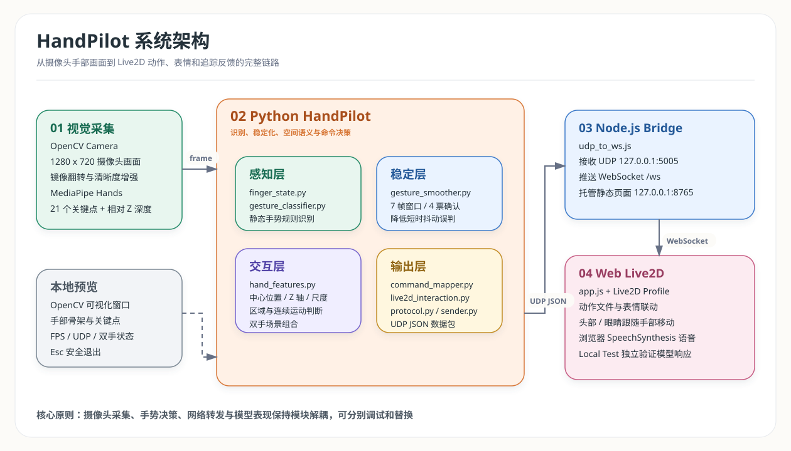
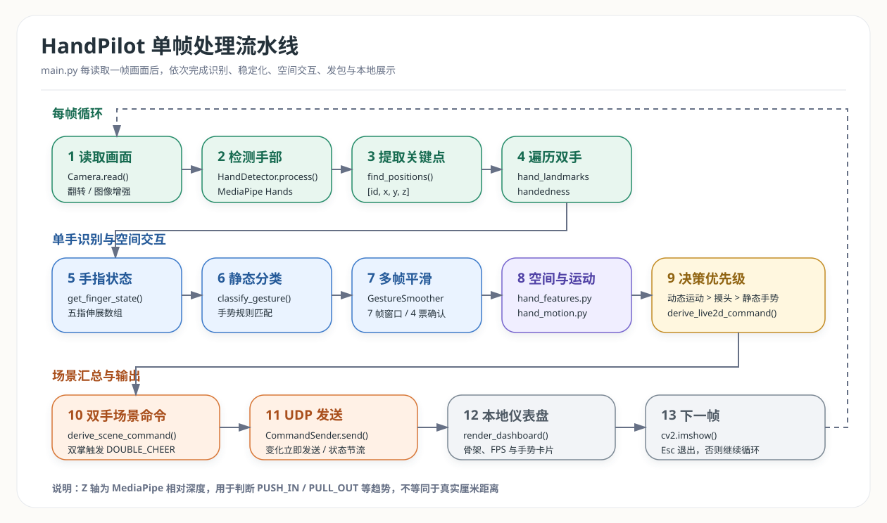

# HandPilot 系统设计与实现说明

## 1. 项目概述

HandPilot 是一个基于摄像头手势识别的 Live2D 实时交互系统。系统将手部画面转换为
可解释的交互命令，再驱动浏览器中的 Live2D 角色执行动作、切换表情、跟随手部位置
转动头部和眼睛，并在部分场景播放语音。

系统由四部分组成：

1. Python 识别端：采集摄像头画面，识别手势并生成交互命令
2. UDP 通信层：以低延迟方式发送识别结果和双手空间特征
3. Node.js Bridge：将 UDP 数据包转发为浏览器可消费的 WebSocket 消息
4. Web Live2D 页面：加载模型，执行动作、表情、追踪参数和语音反馈

当前实现以 Haru Cubism 3 模型作为验证模型。模型相关映射集中在 Profile 文件中，
便于后续替换角色资源。

## 2. 系统架构



[查看可缩放 SVG](./diagrams/handpilot_system_architecture.svg) |
[打开 Draw.io 可编辑源文件](./diagrams/handpilot_architecture.drawio)

### 2.1 分层职责

| 层级 | 主要文件 | 职责 |
| --- | --- | --- |
| 配置层 | `config/settings.py` | 统一管理摄像头、检测器、平滑器、仪表盘和通信参数 |
| 视觉层 | `vision/camera.py`、`vision/hand_detector.py` | 读取画面，调用 MediaPipe Hands，输出关键点和左右手标签 |
| 手势层 | `gesture/*.py` | 判断五指状态、静态手势、空间区域、运动趋势和双手组合 |
| 通信层 | `communication/protocol.py`、`communication/sender.py` | 构造 UDP JSON 协议，执行 Socket 复用、变化检测和节流 |
| 本地展示层 | `utils/*.py` | 显示清晰化预览、FPS、UDP 状态、骨架和双手卡片 |
| Bridge | `bridge/udp_to_ws.js` | 接收 UDP 数据，广播 WebSocket 消息，并托管静态页面 |
| Web 展示层 | `web/app.js`、`web/live2d_profiles/haru.js` | 驱动模型动作、表情、头眼追踪、语音和调试面板 |

### 2.2 解耦设计

HandPilot 将手势识别和模型表现分离：

- Python 端输出 `CMD_WAVE`、`CMD_PET_HEAD` 等通用命令
- Node.js Bridge 只负责协议转发，不理解角色动作
- Web Profile 决定某个模型应播放哪个动作文件、表情和语音

更换 Live2D 模型时，通常只需要新增 Profile 和模型资源，不需要重写识别链路。

## 3. 单帧处理流程



[查看可缩放 SVG](./diagrams/handpilot_frame_pipeline.svg) |
[打开 Draw.io 可编辑源文件](./diagrams/handpilot_architecture.drawio)

`main.py` 每读取一帧画面后执行以下步骤：

1. `Camera.read()` 获取摄像头画面
2. `HandDetector.process()` 调用 MediaPipe Hands 检测手部骨架
3. `find_positions()` 提取每只手的关键点和左右手标签
4. 对每只手依次计算五指状态、静态手势、多帧稳定结果、空间特征和运动趋势
5. `derive_live2d_command()` 按优先级生成单手命令
6. `derive_scene_command()` 检查双手组合命令
7. `CommandSender.send()` 根据变化检测和节流策略发送 UDP 数据包
8. `render_dashboard()` 更新本地仪表盘
9. `cv2.imshow()` 显示画面；按 `Esc` 退出，否则继续下一帧

单手命令的优先级为：

```text
动态运动命令 > 头部区域抚摸命令 > 静态手势命令
```

双手场景命令在单手计算后统一判断。当两只手都为 `OPEN_HAND` 时，场景命令覆盖
单手命令，输出 `CMD_DOUBLE_CHEER`。

## 4. 视觉识别实现

### 4.1 MediaPipe Hands 输出

`vision/hand_detector.py` 将每只手整理为 21 个关键点：

```text
[id, x, y, z]
```

| 字段 | 含义 |
| --- | --- |
| `id` | 关键点编号，范围为 `0 ~ 20` |
| `x` / `y` | 当前画面中的像素坐标 |
| `z` | MediaPipe 提供的相对深度 |

`z` 用于判断手部远近趋势，不等同于摄像头到手掌的真实厘米距离。

### 4.2 五指状态

`gesture/finger_state.py` 将关键点位置转换为五指伸展数组：

```text
[thumb, index, middle, ring, pinky]
```

每个位置取值为 `0` 或 `1`：

- `0`：手指收起
- `1`：手指伸展

### 4.3 静态手势规则

`gesture/gesture_classifier.py` 根据五指状态和拇指方向识别静态手势：

| 手势 | 五指状态或补充条件 | 语义 |
| --- | --- | --- |
| `FIST` | `[0, 0, 0, 0, 0]` | 握拳 |
| `OPEN_HAND` | `[1, 1, 1, 1, 1]` | 张开手掌 |
| `INDEX_UP` | `[0, 1, 0, 0, 0]` | 食指朝上 |
| `V_SIGN` | `[0, 1, 1, 0, 0]` | 剪刀手 |
| `THUMBS_UP` | `[1, 0, 0, 0, 0]` 且拇指朝上 | 点赞 |
| `THUMBS_DOWN` | `[1, 0, 0, 0, 0]` 且拇指朝下 | 失落反馈 |
| `ROCK` | `[1, 1, 0, 0, 1]` | 摇滚手势 |
| `CALL` | `[1, 0, 0, 0, 1]` | 打电话 |
| `THREE` | `[0, 1, 1, 1, 0]` | 三根手指 |
| `FOUR` | `[0, 1, 1, 1, 1]` | 四根手指 |
| `FOUR_THUMB` | `[1, 1, 1, 1, 0]` | 拇指加三指 |
| `PINKY_UP` | `[0, 0, 0, 0, 1]` | 只伸小指 |
| `UNKNOWN` | 未匹配规则 | 未知手势 |

规则分类器的优点是逻辑直观、可解释、便于调试。它的边界也较明确：复杂动态动作、
遮挡较多的手势和角度变化较大的手势，仍需要更丰富的特征或训练模型支持。

### 4.4 多帧投票平滑

单帧识别容易因光照、角度和关键点抖动短暂跳变。`gesture/gesture_smoother.py`
使用滑动窗口投票确认稳定结果：

| 参数 | 当前值 | 作用 |
| --- | --- | --- |
| `SMOOTHER_WINDOW_SIZE` | `7` | 保留最近 7 帧识别结果 |
| `SMOOTHER_CONFIRM_THRESHOLD` | `4` | 同一手势至少出现 4 次才确认 |
| `SMOOTHER_IGNORE_UNKNOWN` | `True` | 已有稳定结果时，短暂 `UNKNOWN` 不立即覆盖 |

该机制是“多帧多数投票”，不是机器学习置信度评分。它在灵敏度和稳定性之间取得平衡：
偶发单帧误判不会立即改变命令，持续手势又能较快得到确认。

## 5. 空间交互实现

### 5.1 空间特征

`gesture/hand_features.py` 根据关键点生成以下特征：

| 字段 | 含义 |
| --- | --- |
| `bbox` | 手部边界框 |
| `center` | 手部中心像素坐标 |
| `center_norm` | `0 ~ 1` 范围内的归一化中心坐标 |
| `center_3d` | 归一化 `x / y` 与相对 `z` |
| `depth.z` | 全部关键点的平均相对深度 |
| `depth.palm_z` | 手掌关键点的平均相对深度 |
| `depth.scale` | 手部边界框在画面中的相对尺度 |
| `depth.level` | `near`、`mid` 或 `far` |
| `palm_normal` | 使用手腕、食指根部和小指根部估算的手掌法线 |
| `tips` / `tips_norm` | 五个指尖的像素坐标和归一化坐标 |

当前远近判断主要使用 `depth.scale`。手部在画面中逐渐变大，通常表示靠近摄像头；
逐渐变小，通常表示远离摄像头。相对 Z 轴和手掌法线已经纳入数据结构，可继续用于
增强三维手势判断。

### 5.2 交互区域

`get_interaction_zone()` 将画面划分为三个区域：

| 区域 | 归一化坐标范围 | 用途 |
| --- | --- | --- |
| `head` | `0.30 <= x <= 0.70` 且 `y <= 0.44` | 角色头部互动 |
| `body` | `0.24 <= x <= 0.76` 且 `0.44 < y <= 0.78` | 角色身体互动 |
| `free` | 其他区域 | 普通手势与运动 |

当 `OPEN_HAND`、`FOUR` 或 `FOUR_THUMB` 位于 `head` 区域时，系统生成
`CMD_PET_HEAD`。

### 5.3 连续运动

`gesture/hand_motion.py` 保留最近 8 个位置样本，并判断以下运动：

| 运动 | 判断依据 | 输出命令 |
| --- | --- | --- |
| `SWIPE_LEFT` | 横向位移小于 `-0.16` 且横向变化占主导 | `CMD_LOOK_LEFT` |
| `SWIPE_RIGHT` | 横向位移大于 `0.16` 且横向变化占主导 | `CMD_LOOK_RIGHT` |
| `RAISE_UP` | 纵向位移小于 `-0.14` 且纵向变化占主导 | `CMD_JUMP_SURPRISE` |
| `MOVE_DOWN` | 纵向位移大于 `0.14` 且纵向变化占主导 | `CMD_BOW` |
| `PUSH_IN` | 手部尺度增加超过 `0.10` | `CMD_COME_CLOSER` |
| `PULL_OUT` | 手部尺度减少超过 `0.10` | `CMD_STEP_BACK` |

运动命令设置 `0.55` 秒冷却时间，避免一次挥动连续触发多次响应。

## 6. 实时通信


[查看可缩放 SVG](./diagrams/handpilot_realtime_link.svg) |
[打开 Draw.io 可编辑源文件](./diagrams/handpilot_architecture.drawio)

### 6.1 链路说明

```text
Python HandPilot
  -> UDP JSON 127.0.0.1:5005
  -> Node.js Bridge
  -> WebSocket ws://127.0.0.1:8765/ws
  -> Web Live2D 页面
```

Python 到 Bridge 使用 UDP，适合持续发送实时状态。Bridge 到浏览器使用 WebSocket，
便于页面维持长连接并即时接收消息。

### 6.2 数据包格式

`communication/protocol.py` 构造 `gesture_command` 数据包：

```json
{
  "version": 1,
  "type": "gesture_command",
  "source": "HandPilot",
  "gesture": "OPEN_HAND",
  "command": "CMD_WAVE",
  "hand": "Right",
  "hands": [
    {
      "index": 0,
      "hand": "Right",
      "gesture": "OPEN_HAND",
      "command": "CMD_WAVE",
      "zone": "free",
      "features": {
        "center_norm": [0.52, 0.48],
        "depth": {
          "z": -0.04,
          "palm_z": -0.02,
          "scale": 0.31,
          "level": "mid"
        }
      },
      "motion": {
        "type": "STILL",
        "dx": 0.0,
        "dy": 0.0,
        "dscale": 0.0
      }
    }
  ],
  "timestamp": 1770000000.123
}
```

顶层 `gesture`、`command` 和 `hand` 便于简单接收端直接使用；`hands[]` 保留每只手的
详细状态，供双手组合和连续追踪使用。

### 6.3 发送策略

`communication/sender.py` 复用一个 UDP Socket，并采用以下策略：

1. 两次发送至少间隔 `0.05` 秒，避免过度发送
2. 手势、命令、左右手、区域或位置网格变化时立即发送
3. 状态不变时每隔 `0.3` 秒重复发送，降低 UDP 丢包和追踪过期影响
4. `CMD_NONE` 在状态不变时不重复发送
5. 手部位置压缩为粗略网格，减少微小抖动导致的无效发包

## 7. Web Live2D 实现

### 7.1 页面职责

`web/app.js` 负责：

- 连接 `ws://127.0.0.1:8765/ws`
- 加载 Haru 模型和本地 Live2D Web 渲染库
- 读取 `gesture_command` 数据包
- 调用 Haru Profile 获取动作、表情、参数 burst 和语音
- 将手部位置映射为头部、眼睛和身体参数
- 渲染控制面板、双手卡片、舞台效果和 Local Test

### 7.2 连续追踪

浏览器根据手部中心坐标和尺度更新模型参数，包括：

```text
ParamAngleX / ParamAngleY / ParamAngleZ
ParamEyeBallX / ParamEyeBallY / ParamEyeBallForm
ParamFaceForm
ParamBodyAngleX / ParamBodyAngleY / ParamBodyAngleZ
ParamBodyUpper
ParamBreath
ParamScarf
ParamHairFront / ParamHairSide
ParamTere
```

追踪与离散动作并行存在：

- 离散命令用于播放明显动作和切换表情
- 连续参数用于让角色头部和眼睛跟随手部移动

### 7.3 Profile 适配层

`web/live2d_profiles/haru.js` 保存 Haru 模型相关配置：

| 配置 | 作用 |
| --- | --- |
| `MODEL_PROFILE` | 模型路径、缩放和初始位置 |
| `COMMAND_ALIASES` | 旧命令兼容映射 |
| `RESPONSE_MAP` | 通用命令到动作、表情、语音和参数效果的映射 |
| `TEST_GROUPS` | Local Test 按钮分组和完整性检查清单 |

模型替换方式见 [Live2D 集成交付与调试手册](./Live2D_Integration_Delivery.md)。

## 8. 当前配置

核心配置位于 `config/settings.py`：

| 配置项 | 当前值 | 说明 |
| --- | --- | --- |
| `CAMERA_INDEX` | `0` | 默认摄像头 |
| `FLIP_IMAGE` | `True` | 镜像翻转 |
| `CAMERA_FRAME_WIDTH` / `CAMERA_FRAME_HEIGHT` | `1280` / `720` | 摄像头期望分辨率 |
| `ENHANCE_PREVIEW_IMAGE` | `True` | 本地预览轻量增强 |
| `HAND_MAX_NUM_HANDS` | `2` | 最大识别手数 |
| `HAND_MIN_DETECTION_CONFIDENCE` | `0.7` | MediaPipe 检测阈值 |
| `HAND_MIN_TRACKING_CONFIDENCE` | `0.7` | MediaPipe 跟踪阈值 |
| `SMOOTHER_WINDOW_SIZE` | `7` | 多帧投票窗口 |
| `SMOOTHER_CONFIRM_THRESHOLD` | `4` | 手势确认票数 |
| `SHOW_DASHBOARD` | `True` | 显示右侧调试面板 |
| `COMMUNICATION_ENABLED` | `True` | 启用 UDP 通信 |
| `COMM_HOST` / `COMM_PORT` | `127.0.0.1` / `5005` | Bridge UDP 地址 |
| `COMM_MIN_INTERVAL` | `0.05` | 最小发送间隔 |
| `COMM_REPEAT_INTERVAL` | `0.3` | 相同状态重复发送间隔 |

## 9. 调试入口

| 目标 | 方法 |
| --- | --- |
| 验证 Python 是否发出 UDP 数据包 | 关闭 Bridge，运行 `python -m tools.udp_receiver_test` |
| 验证 Bridge 是否启动 | 运行 `npm start`，检查 UDP `5005` 和 HTTP `8765` 日志 |
| 验证 WebSocket 是否连接 | 打开页面，查看右侧连接状态 |
| 验证模型响应是否可用 | 使用页面 Local Test 逐项点击 |
| 验证完整链路 | 启动 Bridge、运行 `python main.py`、打开网页并做手势 |

UDP 接收测试器和 Bridge 不能同时绑定 UDP `5005`。需要切换调试目标时，先结束当前
占用端口的程序。

## 10. 已知边界与扩展方向

### 10.1 当前边界

- 静态分类器基于规则，不是训练得到的动作识别模型
- Z 轴是 MediaPipe 相对深度，不是绝对距离
- 当前头部和身体区域使用固定归一化坐标范围
- Haru 是验证模型，动作表现受模型资源和参数能力限制
- 浏览器语音使用 `SpeechSynthesis`，效果依赖系统可用语音

### 10.2 可扩展方向

- 使用手掌法线和相对 Z 轴增强三维手势判断
- 将固定阈值抽取到配置层，便于不同摄像头和场地调参
- 为区域互动增加持续时间、轨迹和冷却判断
- 引入训练模型或可录制样本，扩展复杂动态手势
- 新增 Live2D Profile，支持替换角色和模型差异适配
- 将控制协议扩展为可版本化的事件类型和连续参数通道

## 11. 图表资产

项目图表位于 `docs/diagrams/`：

- [系统架构图 SVG](./diagrams/handpilot_system_architecture.svg)
- [单帧流水线 SVG](./diagrams/handpilot_frame_pipeline.svg)
- [实时通信链路 SVG](./diagrams/handpilot_realtime_link.svg)
- [三页 Draw.io 可编辑源文件](./diagrams/handpilot_architecture.drawio)
- [图表资产说明](./diagrams/README.md)

复杂架构图使用 SVG 和 Draw.io 文件，不再依赖 Markdown Mermaid 预览。SVG 可直接缩放
查看，Draw.io 文件可继续拖拽编辑和导出。
