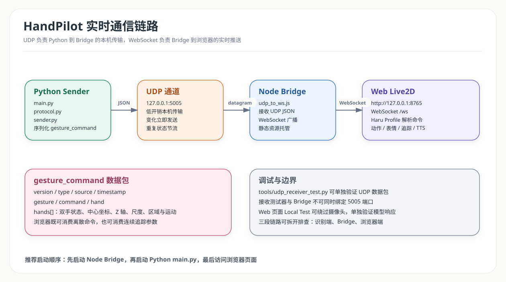

# HandPilot Live2D 集成交付与调试手册

## 1. 交付范围

当前版本已经完成从摄像头手势识别到浏览器 Live2D 响应的完整链路：

```text
摄像头画面
  -> Python + MediaPipe Hands
  -> 手势平滑、空间特征与运动判断
  -> UDP JSON
  -> Node.js Bridge
  -> WebSocket
  -> Web Live2D 动作、表情、追踪和语音
```

当前交付包含：

- 单手和双手识别
- 12 个静态手势映射
- 6 个连续运动响应
- 1 个头部区域抚摸响应
- 1 个双手组合响应
- 20 个可触发的 Haru 模型响应
- 头部、眼睛和身体连续追踪
- 浏览器语音开关与 Local Test 调试面板
- UDP 接收测试器
- Live2D Profile 模型适配层

## 2. 实时链路



[查看可缩放 SVG](./diagrams/handpilot_realtime_link.svg) |
[打开 Draw.io 可编辑源文件](./diagrams/handpilot_architecture.drawio)

### 2.1 端口分配

| 服务 | 地址 | 职责 |
| --- | --- | --- |
| UDP Receiver | `127.0.0.1:5005` | Bridge 接收 Python 数据包 |
| HTTP Server | `http://127.0.0.1:8765` | Bridge 托管 Web 页面和模型资源 |
| WebSocket | `ws://127.0.0.1:8765/ws` | Bridge 向浏览器实时推送消息 |

### 2.2 端口约束

`bridge/udp_to_ws.js` 和 `tools/udp_receiver_test.py` 都需要绑定 UDP `5005`。二者用于
不同调试阶段，不能同时运行。

## 3. 环境安装

### 3.1 Python 依赖

推荐使用 Python `3.12`。当前项目虚拟环境已使用 Python `3.12.10` 验证，可以正常
导入 OpenCV、MediaPipe 和 NumPy。Windows 系统如果安装了多个 Python 版本，应显式
使用 `py -3.12` 创建环境。

在项目根目录执行：

```powershell
py -3.12 -m venv .venv
.\.venv\Scripts\Activate.ps1
pip install -r requirements.txt
```

Python 依赖：

| 依赖 | 版本 | 用途 |
| --- | --- | --- |
| `numpy` | `1.26.4` | 数值处理 |
| `opencv-contrib-python` | `4.11.0.86` | 摄像头读取、画面绘制与窗口显示 |
| `mediapipe` | `0.10.21` | 手部关键点检测 |

### 3.2 Node.js 依赖

进入 `bridge/` 执行：

```powershell
npm install
```

Bridge 仅依赖 `ws`：

```json
{
  "ws": "^8.17.1"
}
```

## 4. 启动方式

### 4.1 完整链路

终端一：启动 Bridge

```powershell
cd bridge
npm start
```

终端二：启动 Python 识别端

```powershell
python main.py
```

浏览器访问：

```text
http://127.0.0.1:8765
```

### 4.2 正常退出

| 程序 | 退出方式 |
| --- | --- |
| `main.py` | 聚焦 OpenCV 预览窗口，按 `Esc` |
| `npm start` | 聚焦 Bridge 终端，按 `Ctrl+C` |
| `python -m tools.udp_receiver_test` | 聚焦测试终端，按 `Ctrl+C` |

`main.py` 的正常退出路径会释放摄像头、UDP Socket 和 OpenCV 窗口资源。

## 5. 分段调试

完整链路由 Python 识别端、Node.js Bridge 和 Web 页面三段组成。出现问题时，不需要
同时排查所有模块。

### 5.1 只验证 Python UDP 发包

先关闭 Bridge，再在项目根目录执行：

```powershell
python -m tools.udp_receiver_test
```

新开终端执行：

```powershell
python main.py
```

接收器会打印来源地址、摘要、延迟估计、协议检查结果和 JSON 内容。

### 5.2 只验证 Web Live2D 响应

启动 Bridge 并打开页面：

```powershell
cd bridge
npm start
```

```text
http://127.0.0.1:8765
```

使用页面右侧 Local Test 按钮，不启动摄像头也可以逐项验证动作、表情、语音和舞台效果。

### 5.3 验证完整链路

1. 启动 Bridge
2. 打开 Web 页面，确认 WebSocket 显示已连接
3. 启动 `python main.py`
4. 做出张开手掌、握拳、剪刀手等静态手势
5. 再测试左右挥动、上下移动、推近、拉远、摸头和双手张开

## 6. 手势与通用命令

### 6.1 静态手势

| 手势 | 识别名称 | 通用命令 | 交互语义 |
| --- | --- | --- | --- |
| 张开手掌 | `OPEN_HAND` | `CMD_WAVE` | 挥手回应 |
| 握拳 | `FIST` | `CMD_IDLE` | 安静待机 |
| 食指朝上 | `INDEX_UP` | `CMD_ATTENTION` | 认真听你说 |
| 剪刀手 | `V_SIGN` | `CMD_HAPPY_POSE` | 开心合影 |
| 拇指朝上 | `THUMBS_UP` | `CMD_PRAISE` | 被夸奖 |
| 拇指朝下 | `THUMBS_DOWN` | `CMD_DISAPPOINTED` | 失落反馈 |
| 摇滚手势 | `ROCK` | `CMD_DANCE` | 舞台活跃 |
| 打电话手势 | `CALL` | `CMD_TALK` | 通话回应 |
| 三根手指 | `THREE` | `CMD_SURPRISE` | 惊讶反应 |
| 四根手指 | `FOUR` | `CMD_CHEER` | 应援鼓励 |
| 拇指加三指 | `FOUR_THUMB` | `CMD_SHY` | 害羞回应 |
| 只伸小指 | `PINKY_UP` | `CMD_PROMISE` | 拉钩约定 |

### 6.2 连续运动

| 手部运动 | 运动名称 | 通用命令 | 交互语义 |
| --- | --- | --- | --- |
| 向左挥动 | `SWIPE_LEFT` | `CMD_LOOK_LEFT` | 向左追踪 |
| 向右挥动 | `SWIPE_RIGHT` | `CMD_LOOK_RIGHT` | 向右追踪 |
| 快速上抬 | `RAISE_UP` | `CMD_JUMP_SURPRISE` | 抬手惊喜 |
| 快速下移 | `MOVE_DOWN` | `CMD_BOW` | 低头回应 |
| 推近镜头 | `PUSH_IN` | `CMD_COME_CLOSER` | 靠近观察 |
| 拉远镜头 | `PULL_OUT` | `CMD_STEP_BACK` | 后退留白 |

### 6.3 空间与双手交互

| 条件 | 通用命令 | 交互语义 |
| --- | --- | --- |
| `OPEN_HAND`、`FOUR` 或 `FOUR_THUMB` 位于头部区域 | `CMD_PET_HEAD` | 摸头害羞 |
| 两只手同时为 `OPEN_HAND` | `CMD_DOUBLE_CHEER` | 双手应援 |

## 7. Haru 模型响应

### 7.1 模型资源

当前模型位于：

```text
web/models/Haru/
```

资源清单：

| 资源 | 数量 | 说明 |
| --- | --- | --- |
| 表情文件 | `8` | `F01 ~ F08` |
| 动作文件 | `27` | `haru_g_idle.motion3.json` 和 `haru_g_m01 ~ m26.motion3.json` |
| `Idle` 分组 | `2` | 默认待机动作 |
| `TapBody` 分组 | `4` | 模型原有点击身体动作 |
| `HandPilot` 分组 | `26` | 为 HandPilot 补充注册的 `m01 ~ m26` 动作 |

### 7.2 动作分组注册

`.motion3.json` 文件存在于模型目录中，不等于渲染库能够通过分组名称和索引调用它。
`Haru.model3.json` 的 `FileReferences.Motions` 用于登记动作分组：

```json
{
  "Motions": {
    "Idle": [],
    "TapBody": [],
    "HandPilot": []
  }
}
```

当前 Haru 模型已经将 `m01 ~ m26` 注册到 `HandPilot` 分组。`web/app.js` 优先按
`motionFile` 解析对应动作，并保留 `fallbackMotion` 作为兜底。换用其他 Web Live2D
库或其他模型时，仍应检查动作是否完成注册。

### 7.3 响应对照表

| 通用命令 | Haru 动作 | 表情 | 语音 |
| --- | --- | --- | --- |
| `CMD_WAVE` | `m05` | `F05` | 你好呀，我看到你的手势啦 |
| `CMD_LOOK_LEFT` | `m03` | `F01` | 无 |
| `CMD_LOOK_RIGHT` | `m04` | `F01` | 无 |
| `CMD_JUMP_SURPRISE` | `m12` | `F02` | 欸？手突然抬起来了 |
| `CMD_BOW` | `m14` | `F01` | 无 |
| `CMD_COME_CLOSER` | `m18` | `F06` | 你靠近了，我看得更清楚啦 |
| `CMD_STEP_BACK` | `m19` | `F08` | 无 |
| `CMD_IDLE` | `Idle[0]` | `F01` | 好，我先安静一下 |
| `CMD_ATTENTION` | `m06` | `F02` | 嗯，我在听，请继续 |
| `CMD_HAPPY_POSE` | `m26` | `F05` | 耶，这个手势很适合拍照 |
| `CMD_PRAISE` | `m08` | `F05` | 谢谢夸奖，我会继续加油 |
| `CMD_DISAPPOINTED` | `m13` | `F08` | 我会再调整一下，不要失望嘛 |
| `CMD_DANCE` | `m10` | `F05` | 节奏来了，进入舞台模式 |
| `CMD_TALK` | `m07` | `F01` | 喂喂，HandPilot 通信正常 |
| `CMD_SURPRISE` | `m11` | `F02` | 哇，三根手指触发了惊喜 |
| `CMD_CHEER` | `m24` | `F05` | 收到四指信号，给你加油 |
| `CMD_SHY` | `m17` | `F07` | 这个手势有点可爱，我有点害羞 |
| `CMD_PROMISE` | `m16` | `F07` | 勾一下小指，这是我们的约定哦 |
| `CMD_PET_HEAD` | `m22` | `F07` | 唔，被摸头了，有点害羞 |
| `CMD_DOUBLE_CHEER` | `m21` | `F05` | 双手同步，能量满格 |

语音不是每个连续运动都强制播放。左右追踪、低头和后退等高频动作保持无语音，避免
频繁播报干扰交互。

### 7.4 头眼追踪

手部中心坐标和尺度会持续映射到模型参数：

```text
ParamAngleX / ParamAngleY / ParamAngleZ
ParamEyeBallX / ParamEyeBallY / ParamEyeBallForm
ParamFaceForm
ParamBodyAngleX / ParamBodyAngleY / ParamBodyAngleZ
ParamBodyUpper
ParamBreath
ParamScarf
ParamHairFront / ParamHairSide
ParamTere
```

模型会围绕画面中的手部位置转动头部和眼睛。UDP 相同状态每隔 `0.3` 秒重复发送一次，
浏览器追踪数据新鲜度窗口为 `1.5` 秒，避免手部静止时模型过早回到中央。

### 7.5 舞台效果与服饰边界

Profile 中的 `costume` 字段用于切换页面舞台视觉主题，例如 `soft`、`focus`、`spark`、
`calm`、`dance` 和 `blush`。它不是 Live2D 服装贴图切换。

如果需要真正更换服饰，模型本身必须提供对应的部件、纹理或参数开关，再在 Profile
中增加相应映射。

## 8. 更换 Live2D 模型

### 8.1 当前兼容范围

当前页面已经使用 Haru Cubism 3 的 `.model3.json` 资源完成验证。其他 Cubism 3 模型
可以沿用 Profile 适配方式。Cubism 2 或模型结构差异较大的资源需要单独验证渲染库和
参数名称。

### 8.2 换模步骤

1. 将新模型资源放入 `web/models/<model-name>/`
2. 确认模型入口文件、动作文件和表情文件可以被浏览器访问
3. 检查 `.model3.json` 的 `FileReferences.Motions` 和 `Expressions`
4. 复制 `web/live2d_profiles/haru.js` 创建新 Profile
5. 修改 `MODEL_PROFILE.modelPath`、缩放、位置和追踪参数
6. 根据新模型资源重写 `RESPONSE_MAP`
7. 为所有响应补齐 `TEST_GROUPS`
8. 在 `web/app.js` 顶部切换 Profile import
9. 使用 Local Test 逐项验证动作、表情、语音和参数效果
10. 再启动 Python 端验证完整手势链路

### 8.3 换模工作量判断

| 模型情况 | 工作量 | 说明 |
| --- | --- | --- |
| Cubism 3，动作和表情完整 | 较低 | 主要修改 Profile 映射 |
| Cubism 3，但动作分组未注册 | 中等 | 需要补充 `model3.json` 分组或调整调用方式 |
| 参数名称差异较大 | 中等 | 需要调整追踪参数 |
| 缺少目标动作、表情或服饰部件 | 较高 | 需要在 Live2D 编辑器中制作或替换资源 |
| Cubism 2 或来源不明的资源 | 较高 | 需要额外验证格式、渲染库兼容性和授权范围 |

## 9. 常见问题

### 9.1 Bridge 提示 UDP 端口绑定失败

原因通常是另一个 Bridge 或 `tools.udp_receiver_test` 已经占用 `5005`。关闭占用端口
的程序后重试。

### 9.2 页面能够打开，但 WebSocket 未连接

检查：

1. Bridge 是否仍在运行
2. 页面是否从 `http://127.0.0.1:8765` 打开
3. `bridge/udp_to_ws.js` 中 WebSocket 路径是否为 `/ws`
4. 浏览器控制台是否有连接错误

### 9.3 WebSocket 已连接，但模型不响应手势

按顺序检查：

1. `config/settings.py` 中 `COMMUNICATION_ENABLED = True`
2. Python 仪表盘是否显示 UDP `ON`
3. Bridge 终端是否收到 UDP 消息
4. 页面控制面板是否更新 `Gesture` 和 `Command`
5. Local Test 是否能触发对应模型响应

### 9.4 模型能够响应，但动作差异不明显

检查 Profile 中不同命令是否仍指向相同动作文件。Haru Profile 已为 20 个命令配置
不同动作、表情或参数变化，但模型本身的可动范围仍会限制最终效果。

### 9.5 头眼追踪偶尔回到中央

检查：

1. Python 端是否持续运行
2. `COMM_REPEAT_INTERVAL` 是否保持为 `0.3`
3. Bridge 是否持续转发消息
4. 浏览器是否长时间未收到手部位置数据

## 10. 交付文件

| 路径 | 用途 |
| --- | --- |
| `main.py` | Python 主程序 |
| `config/settings.py` | 全局参数 |
| `gesture/` | 手势、空间和运动识别 |
| `communication/` | UDP 协议和发送器 |
| `tools/udp_receiver_test.py` | UDP 手动测试器 |
| `bridge/udp_to_ws.js` | UDP -> WebSocket Bridge |
| `web/app.js` | Live2D 页面控制器 |
| `web/live2d_profiles/haru.js` | Haru 模型适配器 |
| `web/models/Haru/` | Haru 模型资源 |
| `docs/HandPilot_Project_Description.md` | 系统设计说明 |
| `docs/diagrams/` | SVG 图表和 Draw.io 可编辑源文件 |
