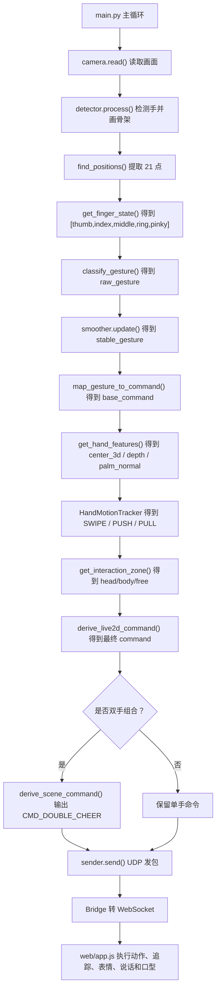
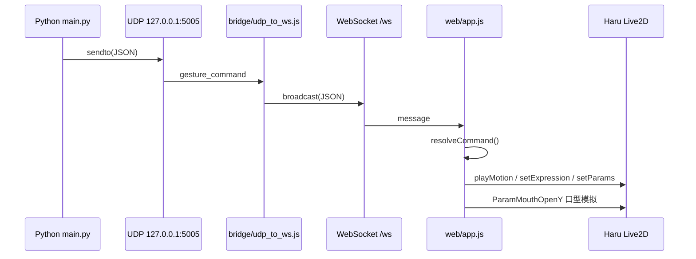

# HandPilot × Live2D 集成交付说明

## 1. 当前交付目标

本次集成把 HandPilot 从“只发送 UDP 命令的手势识别程序”扩展成了一个完整的 Live2D 角色交互系统：

```text
摄像头手势
→ Python 识别与平滑
→ UDP JSON
→ Node Bridge
→ WebSocket
→ Web Live2D 页面
→ Haru 模型动作 / 表情 / 语言 / 舞台反馈
```

核心思路是：Python 端继续专注识别，Web 端专注表现，中间用 Bridge 连接两者

---

## 2. 新增与修改内容

### 2.1 新增文件

```text
bridge/
├─ package.json                 # Node Bridge 依赖与启动脚本
└─ udp_to_ws.js                 # UDP → WebSocket，同时提供 Live2D 网页服务

web/
├─ index.html                   # Live2D 展示页面
├─ style.css                    # Live2D 页面视觉样式
├─ app.js                       # WebSocket 接收、模型控制、语言气泡、口型同步
├─ live2d_profiles/             # 模型适配层，保存不同模型的动作/表情映射
├─ vendor/l2d/                  # 本地 l2d 运行库，避免依赖 CDN
└─ models/
   └─ Haru/                     # 已解压的 Haru Live2D model3 模型

gesture/
├─ hand_features.py             # 手部中心点、边界框、归一化坐标等空间特征
├─ hand_motion.py               # 根据最近几帧判断挥动、靠近、远离等动态意图
└─ live2d_interaction.py        # 摸头、双手应援等 Live2D 互动意图

docs/
└─ Live2D_Integration_Delivery.md
```

### 2.2 修改文件

```text
main.py                         # UDP 数据中加入 zone/features/motion，并支持 Live2D 互动命令
gesture/command_mapper.py       # 将旧机械控制命令改为更自然的 Live2D 角色命令
communication/sender.py         # 发送器加入粗略位置网格，支持头部跟随类更新
communication/protocol.py       # 更新协议说明
config/settings.py              # 将通信说明从 Unity 改为 Live2D Bridge
tools/udp_receiver_test.py      # 更新端口占用提示
```

### 2.3 当前解耦方式

```text
Python 手势识别层
→ 输出稳定命令 CMD_*
→ Web 主控制器 app.js 负责连接、追踪、面板、通用 setParams
→ live2d_profiles/haru.js 负责 Haru 专属动作、表情、说话文案
```

也就是说，`CMD_WAVE` 这类命令是项目协议，`haru_g_m26.motion3.json` 这类文件才是某个模型自己的资源。以后换模型时，优先新增 profile，而不是改 Python 协议。

---

## 3. 系统架构图

```mermaid
flowchart LR
    User["用户手势"] --> Camera["Camera<br/>OpenCV 摄像头"]
    Camera --> Detector["HandDetector<br/>MediaPipe Hands"]
    Detector --> Finger["finger_state<br/>五指伸屈"]
    Finger --> Classifier["gesture_classifier<br/>手势名称"]
    Classifier --> Smoother["GestureSmoother<br/>多帧稳定"]
    Smoother --> Mapper["command_mapper<br/>Live2D 基础命令"]
    Mapper --> Motion["hand_motion<br/>挥动 / 靠近 / 远离"]
    Motion --> Interaction["live2d_interaction<br/>摸头 / 双手组合"]
    Interaction --> Sender["CommandSender<br/>UDP JSON"]
    Sender --> Bridge["Node Bridge<br/>UDP → WebSocket"]
    Bridge --> Web["Web 前端<br/>L2D + Canvas"]
    Web --> Haru["Haru Live2D<br/>动作 / 表情 / 语言"]
```



---

## 4. 每帧数据流



---

## 5. 通信链路图



---

## 6. 手势与 Live2D 响应映射表

| 手势 | 基础命令 | Live2D 响应 | 设计原因 |
|---|---|---|---|
| `OPEN_HAND` 张开手掌 | `CMD_WAVE` | 挥手、微笑、打招呼 | 张手更像“你好 / 我在这里”，比“启动”更自然 |
| `FIST` 握拳 | `CMD_IDLE` | 收起动作，回到安静待机 | 握拳像暂停或收束，不适合角色兴奋回应 |
| `INDEX_UP` 食指 | `CMD_ATTENTION` | 认真听你说 | 食指像提示重点，角色进入注意状态 |
| `V_SIGN` 比耶 | `CMD_HAPPY_POSE` | 开心合影动作 | 避免“你比耶她点头/摇头”的不自然映射 |
| `THUMBS_UP` 拇指上 | `CMD_PRAISE` | 开心、被夸奖、感谢 | 符合日常语义 |
| `THUMBS_DOWN` 拇指下 | `CMD_DISAPPOINTED` | 委屈、失落 | 符合日常语义 |
| `ROCK` 摇滚手势 | `CMD_DANCE` | 舞台动作与暖光 | 手势本身带有音乐感 |
| `CALL` 打电话 | `CMD_TALK` | 说话气泡和通话回应 | “电话”天然对应语言效果 |
| `THREE` 三指 | `CMD_SURPRISE` | 惊讶反应 | 作为轻量扩展手势 |
| `FOUR` 四指 | `CMD_CHEER` | 应援鼓励 | 四指比张手更有“信号”感 |
| `FOUR_THUMB` / `PINKY_UP` | `CMD_SHY` | 害羞表情 | 适合角色可爱反应 |
| `OPEN_HAND` 且 `zone=head` | `CMD_PET_HEAD` | 脸红、摸头回应、说话气泡 | 用手掌位置叠加空间语义 |
| 双手同时 `OPEN_HAND` | `CMD_DOUBLE_CHEER` | 双手应援、舞台光效 | 双手组合适合更强烈的全局反应 |
| `UNKNOWN` | `CMD_NONE` | 保持等待 | 避免错误识别频繁打断角色 |

### 6.1 动态手势与追踪响应

这些命令不是单靠五指状态判断，而是根据手在最近几帧中的位置变化判断：

| 手部运动 | 动态命令 | Live2D 响应 |
|---|---|---|
| 手明显向左滑动 | `CMD_LOOK_LEFT` | 头部、眼睛、身体向左追踪 |
| 手明显向右滑动 | `CMD_LOOK_RIGHT` | 头部、眼睛、身体向右追踪 |
| 手向上抬 | `CMD_JUMP_SURPRISE` | 抬头惊讶、星光舞台效果 |
| 手向下压 | `CMD_BOW` | 低头/鞠躬式回应 |
| 手靠近摄像头 | `CMD_COME_CLOSER` | 靠近观察、眼睛放大感 |
| 手远离摄像头 | `CMD_STEP_BACK` | 后退留白、冷静动作 |

注意：这里的 z 轴不是毫米级真实三维坐标，而是 MediaPipe 的相对深度 `lm.z` 加上手部画面占比 `depth.scale` 共同估计。它足够用于“靠近/远离”和角色跟随，但不适合做精密测距。

### 6.2 当前前端实际配置的 Live2D 响应

当前 Haru profile 中共配置了 19 个命令响应：

| 命令 | 表情 | 动作来源 | 是否有语言 |
|---|---|---|---|
| `CMD_WAVE` | `F05` | `TapBody[0]` | 有 |
| `CMD_IDLE` | `F01` | `Idle[0]` | 有 |
| `CMD_ATTENTION` | `F02` | `motions/haru_g_m06.motion3.json` | 有 |
| `CMD_HAPPY_POSE` | `F05` | `motions/haru_g_m26.motion3.json` | 有 |
| `CMD_PRAISE` | `F05` | `TapBody[2]` | 有 |
| `CMD_DISAPPOINTED` | `F08` | `TapBody[3]` | 有 |
| `CMD_DANCE` | `F05` | `motions/haru_g_m10.motion3.json` | 有 |
| `CMD_TALK` | `F01` | `TapBody[3]` | 有 |
| `CMD_SURPRISE` | `F02` | `motions/haru_g_m12.motion3.json` | 有 |
| `CMD_CHEER` | `F05` | `motions/haru_g_m24.motion3.json` | 有 |
| `CMD_SHY` | `F07` | `motions/haru_g_m17.motion3.json` | 有 |
| `CMD_PET_HEAD` | `F07` | `TapBody[2]` + 参数加强 | 有 |
| `CMD_DOUBLE_CHEER` | `F05` | `motions/haru_g_m21.motion3.json` | 有 |
| `CMD_LOOK_LEFT` | `F01` | `motions/haru_g_m03.motion3.json` + 参数加强 | 无 |
| `CMD_LOOK_RIGHT` | `F01` | `motions/haru_g_m04.motion3.json` + 参数加强 | 无 |
| `CMD_JUMP_SURPRISE` | `F02` | `motions/haru_g_m12.motion3.json` + 参数加强 | 有 |
| `CMD_BOW` | `F01` | `motions/haru_g_m14.motion3.json` + 参数加强 | 无 |
| `CMD_COME_CLOSER` | `F06` | `motions/haru_g_m18.motion3.json` + 参数加强 | 有 |
| `CMD_STEP_BACK` | `F08` | `motions/haru_g_m19.motion3.json` + 参数加强 | 无 |

这里有一个重要区别：

```text
motion / motionFile = 模型资源里已经做好的动作
setParams / burst   = 前端实时驱动模型参数做出来的增强动作
```

所以“动作”不只有压缩包里现成的 `.motion3.json`，也可以通过参数驱动叠加出跟随、脸红、身体倾斜、眼睛追踪、围巾摆动等效果。

### 6.3 Haru 压缩包实际资源

Haru 当前模型目录中有：

```text
表情：8 个
F01, F02, F03, F04, F05, F06, F07, F08

动作文件：27 个
haru_g_idle.motion3.json
haru_g_m01.motion3.json ~ haru_g_m26.motion3.json
```

原始 `Haru.model3.json` 中正式分组注册的动作只有：

```text
Idle    = 2 个动作
TapBody = 4 个动作
```

这里的“正式分组注册”可以理解为：`model3.json` 是 Live2D 模型的资源目录表，`Motions`
字段告诉运行时“有哪些动作文件可以被调用，以及它们属于哪个动作组”

```text
动作文件存在于文件夹中     = 书真的放在书架上
动作写进 model3.json 分组 = 书被写进目录索引里，可以按名字找到
```

本项目已经在 `Haru.model3.json` 中新增了 `HandPilot` 动作分组，并把
`haru_g_m01.motion3.json ~ haru_g_m26.motion3.json` 都补进了这个分组。这样前端通过
`playMotionByFile()` 或动作资源表查找时更稳定，不依赖运行时是否会自动扫描文件夹。

### 6.4 模型格式兼容性

当前 Web 端使用的 `web/vendor/l2d/index.js` 同时包含 Cubism2 和 Cubism3+/6 的加载逻辑，所以理论上可以加载：

```text
Cubism2 老模型：*.model.json + *.moc + *.mtn
Cubism3+ 模型：*.model3.json + *.moc3 + *.motion3.json
```

但本项目目前推荐优先使用 `.model3.json` 模型。原因是 Haru profile、动作注册、表情映射、参数驱动和
`playMotionByFile()` 都是围绕 Cubism3+ 的资源组织方式设计的。如果换成 Cubism2 老模型，可能能显示，
但动作、表情、参数名和文件格式都需要单独适配。

---

## 7. UDP 数据结构

现在每个 UDP 包仍然是 JSON，但 `hands` 中新增了空间信息：

```json
{
  "version": 1,
  "type": "gesture_command",
  "source": "HandPilot",
  "gesture": "OPEN_HAND",
  "command": "CMD_PET_HEAD",
  "hand": "Left",
  "hands": [
    {
      "index": 0,
      "hand": "Left",
      "label": "R",
      "raw_gesture": "OPEN_HAND",
      "gesture": "OPEN_HAND",
      "base_command": "CMD_WAVE",
      "command": "CMD_PET_HEAD",
      "fingers": [1, 1, 1, 1, 1],
      "zone": "head",
      "motion": {
        "type": "STILL",
        "dx": 0.0,
        "dy": 0.0,
        "dscale": 0.0
      },
      "features": {
        "bbox": {"x": 420, "y": 80, "w": 260, "h": 320},
        "center": [550, 240],
        "center_norm": [0.43, 0.33],
        "center_3d": [0.43, 0.33, -0.031],
        "depth": {
          "z": -0.031,
          "palm_z": -0.027,
          "scale": 0.44,
          "level": "mid"
        },
        "palm_normal": [0.12, -0.24, 0.96]
      }
    }
  ],
  "timestamp": 1779159700.246
}
```

前端主要使用这些字段：

```text
command              # 最终动作命令
hands[].command      # 每只手自己的命令
hands[].zone         # head/body/free
hands[].motion       # SWIPE_LEFT / PUSH_IN 等动态意图
hands[].features     # 头眼追踪、区域判断、深度判断、调试面板显示
timestamp            # 延迟显示
```

---

## 8. 启动方式

### 8.1 第一次运行

建议先使用 Python 3.11 或 Python 3.12 建立虚拟环境。当前项目依赖 OpenCV、MediaPipe 和 NumPy，
不建议直接使用 Python 3.14，否则可能出现 `cv2` 或 `mediapipe` 无法安装 / 无法导入的问题。

```powershell
py -3.11 -m venv .venv
.\.venv\Scripts\Activate.ps1
python -m pip install -U pip
pip install -r requirements.txt
```

安装 Bridge 依赖：

```powershell
cd bridge
npm install
```

### 8.2 正常启动

终端 1：启动 Bridge 和 Live2D 页面服务

```powershell
cd bridge
npm start
```

看到类似输出：

```text
UDP 监听已启动：127.0.0.1:5005
Live2D 页面：http://127.0.0.1:8765
WebSocket：ws://127.0.0.1:8765/ws
```

然后在浏览器打开：

```text
http://127.0.0.1:8765
```

终端 2：启动 Python 手势识别

```powershell
.\.venv\Scripts\Activate.ps1
python main.py
```

然后对摄像头做手势，Live2D 页面会实时响应

### 8.3 快速判断是否启动成功

```text
1. OpenCV 摄像头窗口能打开
2. Live2D 页面右侧显示 WebSocket 已连接
3. Bridge 终端能看到 UDP 日志
4. Live2D 角色会根据手势播放动作、表情、语言或追踪反馈
```

退出方式：

```text
Python 主程序：按 Esc
Bridge 服务：按 Ctrl+C
```

---

## 9. 调试方式

### 9.1 只测试前端

打开 `http://127.0.0.1:8765` 后，可以点击页面右侧 `Local Test` 按钮，不开摄像头也能触发动作

### 9.2 只测试 UDP

如果不启动 Bridge，可以单独运行：

```bash
python -m tools.udp_receiver_test
```

注意：`tools/udp_receiver_test.py` 和 `bridge/udp_to_ws.js` 不能同时占用 `127.0.0.1:5005`

### 9.3 常见问题

| 问题 | 原因 | 处理 |
|---|---|---|
| Live2D 页面打开但没有模型 | l2d 本地运行库或模型路径异常 | 看浏览器 F12 Console，确认 `web/vendor/l2d/` 和 `web/models/Haru/` 存在 |
| Bridge 启动失败 | 端口 5005 或 8765 被占用 | 关闭旧进程，或改环境变量 |
| Python 有识别但模型不动 | Bridge 没开或 WebSocket 未连接 | 确认页面右侧显示 WebSocket 已连接 |
| 没有声音 | 浏览器自动播放策略限制 | 点击页面里的“开启角色声音” |
| 摸头不触发 | 手没有进入上方中间区域 | 手掌放到画面上方中间，保持张手 |
| `ModuleNotFoundError: No module named 'cv2'` | 当前终端 Python 环境没有安装 OpenCV | 激活 `.venv` 后重新安装 `requirements.txt` |
| `mediapipe` 安装失败 | Python 版本过新或依赖轮子不匹配 | 优先使用 Python 3.11 / 3.12 |
| `__pycache__` 写入失败 | OneDrive 或编辑器锁定了缓存文件 | 关闭占用进程，必要时删除对应 `__pycache__` 后重试 |

---

## 10. 关于语言、表情、动作和服饰效果

### 10.1 语言效果

当前实现为“说话气泡 + 逐字显示 + `ParamMouthOpenY` 口型模拟”

这比直接播放固定音频更容易扩展，后续可以接入 TTS 或提前录制的角色语音

### 10.2 表情效果

Haru 提供 `F01` ~ `F08` 8 个表情，本次映射中重点使用：

```text
F01  普通微笑
F02  惊讶/认真
F05  开心闭眼
F07  害羞脸红
F08  低落/不满
```

### 10.3 动作效果

Haru 的原始 `model3.json` 明确配置了 `Idle` 与 `TapBody` 两组动作。本项目为了让手势交互更稳定，
额外补充了 `HandPilot` 动作分组，用来集中注册 `m01 ~ m26` 这批可交互动作。

前端优先使用：

```text
playMotion(group, index, priority)
playMotionByFile(file, priority)
```

这样既保留原模型结构，又能更可靠地调用更多动作资源

### 10.4 服饰效果

当前 Haru 模型只有一套制服部件，没有多套衣装贴图或衣装切换参数

所以本次实现的是“服饰氛围效果”：

```text
soft   制服柔光
calm   冷静浅蓝
blush  害羞粉光
dance  舞台暖光
```

同时前端会尝试驱动 `ParamScarf`，让围巾/服饰细节在舞台模式中更活跃

如果后续换成有多套衣装参数的 Live2D 模型，可以把 `web/app.js` 里的 `setCostumeEffect()` 扩展为真实换装

---

## 10.5 更换 Live2D 模型的工作量

如果新模型也是标准 Cubism 3/4/6 的 `.model3.json`，工作量通常不大：

```text
轻度替换：只换模型路径和缩放位置，约 10~20 分钟
中度适配：重新挑选动作/表情映射，约 1~2 小时
深度演出：自定义动作、参数、语音、服饰、热点区域，按效果复杂度增加
```

推荐换模型流程：

1. 把新模型放到 `web/models/ModelName/`
2. 打开新模型的 `*.model3.json`，确认 `Expressions`、`Motions`、`HitAreas`
3. 复制 `web/live2d_profiles/haru.js` 为 `web/live2d_profiles/model_name.js`
4. 修改 `MODEL_PROFILE.modelPath`、`modelScale`、`modelPosition`
5. 把 `RESPONSE_MAP` 中的 `expression` 和 `motionFile` 换成新模型真实存在的资源
6. 在 `web/app.js` 顶部 import 新 profile

需要注意：

- 不同模型的表情名不一定是 `F01`、`F02`
- 不同模型的动作组不一定叫 `Idle`、`TapBody`
- 有些模型没有声音文件或没有 HitAreas
- 有些模型没有 `ParamTere`、`ParamScarf` 这类参数，burst 参数需要按模型实际参数调整
- 如果模型有真实换装参数，才能做真正服饰切换；否则只能做现在这种舞台光效模拟

---

## 11. 后续优化建议

1. 用更稳定的几何规则识别“抚摸”动作，例如检测手掌在头部区域内的横向小幅移动
2. 给 Python 端增加 `--no-preview`，演示时只开 Live2D 页面
3. 给 Web 端加模型选择器，支持 Haru / Mao / Hiyori 等多角色
4. 把 Bridge 升级成 Electron 主进程，最终做成一个桌面应用
5. 如果模型资源允许，增加真实换装、饰品显隐和更丰富的角色语音

---

## 12. BanG Dream / Bandori 模型调研

当前能找到一些 BanG Dream 相关的公开 Live2D 资源或查看器，但需要注意“能看到资源”和“能直接接入本项目”不是一回事。

### 12.1 可参考资源

```text
Live2D 官方案例 / 访谈
说明 BanG Dream! Girls Band Party! 确实使用了 Live2D 技术

seia-soto/BanG-Dream-Live2D
公开 GitHub 归档，包含大量 Bandori 角色与服装资源

Bestdori Live2D Viewer
Bandori 社区工具，适合查看角色、服装、动作和差分

Haneoka BanG Dream! Live2D / Spine 查看器
第三方在线查看器，支持 Live2D 与 Spine 预览和导出
```

### 12.2 格式判断

我实际检查了 `seia-soto/BanG-Dream-Live2D` 仓库的文件树，它主要是 Cubism2 老资源：

```text
*.model.json
*.moc
*.mtn
*.exp
```

没有看到 Cubism3+ 常见的：

```text
*.model3.json
*.moc3
*.motion3.json
*.exp3.json
```

所以这类 Bandori 资源更适合走“Cubism2 兼容路线”。我们当前前端运行库理论上有 Cubism2 加载分支，
但 Haru profile、动作调用、表情映射和参数驱动主要按 Cubism3+ 组织。直接替换成 Bandori 老模型时，
需要额外做这些适配：

```text
1. 确认 model.json 是否完整引用 moc、textures、motions、expressions
2. 把 .mtn 动作映射到 HandPilot 的 CMD_* 命令
3. 把 .exp 表情映射到 RESPONSE_MAP
4. 检查参数名是否支持头部、眼睛、身体追踪
5. 如有必要，为老模型单独写 bandori_cubism2.js profile
```

### 12.3 版权提醒

公开上传不等于可以商用或再分发。Bandori 相关角色、素材、商标通常仍归原权利方所有。
如果只是本地学习和技术验证，风险相对低；如果要公开发布、参赛、上线网站或打包成应用，就应该优先使用：

```text
1. 官方明确允许使用的模型
2. 创作者授权的同人模型
3. 自己制作或约稿并获得授权的模型
4. Live2D 官方样例模型或可商用素材包
```

---

## 13. 参考来源

- l2d 官方文档：https://l2d.hacxy.cn
- l2d npm 包：https://www.npmjs.com/package/l2d
- Live2D 官方 BanG Dream! 案例：https://www.live2d.com/business/interview/bangdream/
- BanG Dream Live2D GitHub 归档：https://github.com/seia-soto/BanG-Dream-Live2D
- Bestdori Live2D Viewer：https://bestdori.com/tool/live2dviewer
- Haneoka BanG Dream! Live2D / Spine 查看器：https://live2d.haneoka.org/
- Live2D Cubism SDK 许可说明：https://www.live2d.com/eula/live2d-proprietary-software-license-agreement_en.html
